# 🛠️Next.js 를 사용한 간단한 웹 만들기

<br/>
<p>


<p/>
<br/>

## 시작하기 전에...

- **Next.js** 를 사용하기 위해 `Console` 창을 열어서 명령어 실행
- `npx create-next-app@latest`
- TS 를 사용하고 싶을 땐 `--typescript` 추가

<br/>
<hr/>

###### 20230501

> ## Next.js 으로 프로젝트 생성하기

<br/>
<p>


<p/>
<br/>
<br/>

- 명령어를 입력해 프로젝트 생성
- `npx create-next-app@latest`
- 터미널 창에서 `npm run dev` 를 실행 후 `localhost:3000` 에 접근 할 시 기본 창이 나옴

<br/>

> ## Library vs Framework

<br/>

- 라이브러리는 사용자가 직접 찾아서 사용하는 반면, 프레임워크는 기존의 틀에 맞춰서 작성해야 함

<br/>

| Library   | Framework      |
| --------- | -------------- |
| 직접 사용 | 틀에 맞춰 사용 |
| 유동적    | 형식적         |
| 자유로움  | 펀리함         |

<br/>
<p>


<p/>
<br/>

- `pages/...` 에 파일을 생성하면 자동으로 `routing` 됨
- 라이브러리 처럼 `router` 를 사용하지 않아도 되므로 편리함

<br/>

<br/>
<hr/>

###### 20230503

> ## Next.js Rendering

<br/>

- `Next.js` 는 `CRA(Create React App)` 와는 다르게 미리 웹 페이지를 만든 후 사용자에게 전달
- 사용자의 인터넷 속도, JS 동작 여부와는 상관없이 html 을 정상적으로 보여줌

<br/>
<br/>

<br/>

`Next.js` 는 웹페이지를 **Pre-Rendering** 한 후 뿌려줌

`ctrl + U` 로 확인하면 다수의 스크립트들이 보임

<br/>

<br/>

웹 페이지에서 JS 기능이 동작하지 않을 때를 테스트 하기 위 해 만든 테스트 페이지

<br/>

<br/>

`F12 > Setting > Preferences > Debugger` 의 JS 사용을 잠시 제한

<br/>

<br/>

웹 페이지를 확인 해 보면 **HTML** 은 있지만 JS 가 꺼져있기 때문에 동작은 하지 않는 모습

`CRA` 로 만든 웹은 직접 JS 를 받아와서 실행하며 뿌려주기 때문에 JS 가 동작하지 않을 경우 웹 자체를 받아올 수 없음

하지만 `Next.js` 는 **Pre-Rendering** 으로 먼저 받아오기 때문에 **HTML** 은 존재하되 동작만 되지 않음

<br/>
<br/>
<hr/>

###### 20230504

> ## Link-Component

<br/>

```TSX
export default function NavBar() {
  return (
    <nav>
      <a href="/">
        Home
      </a>
      <a href="/about">
        About
      </a>
    </nav>
  );
```

- `anchor tag` 를 사용해 간단하게 `routing` 을 살 수 있지만 권장되지 않음
- `anchor` 를 사용하면 페이지가 새로고침 되기 때문에 `re-rendering`에 적합하지 않음
- 따라서 `Next.js` 에서 제공하는 `Link` 를 사용

```TSX
export default function NavBar() {
  return (
    <nav>
      <Link href="/">
        Home
      </Link>
      <Link href="/about">
        About
      </Link>
    </nav>
  );

  // Next ver 13 이후로 Link 안에 anchor 의 속성을 부여 할 수 있음 ex) className, style...
```

<br/>
<br/>
<p>
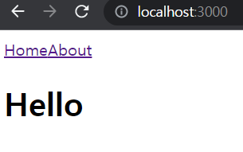
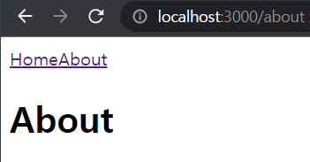
<p/>

정상적으로 작동하는 모습

<br/>

> ## useRouter-Hook

<br/>

- `Next.js` 에는 **url** 을 관리하기 편하게 해주는 `Hook` 이 존재 함
- `useRouter()`

<br/>

```TSX

export default function NavBar() {
  const router = useRouter();
  // Next.js 내 route 를 관리하는 Hook, console.log 를 찍어보면 상세 정보를 알 수 있음
  // console.log(router);
  return (
    <nav>
      <Link
        style={{
          color: router.pathname === "/" ? "red " : "blue",
        }}
        href="/"
      >
        Home
      </Link>
      <Link
        style={{
          color: router.pathname === "/about" ? "red " : "blue",
        }}
        href="/about"
      >
        About
      </Link>
    </nav>
  );
}
```

<br/>
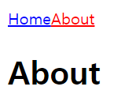
<br/>

<br/>
<br/>
<hr/>

###### 20230505

> ## module.css

<br/>

- `Next.js` 에서 `css` 를 주는 방법 중에 `module` 을 사용하는 방법
- **동일한 파일명에 .module.css 로 새로운 파일 생성**
- 해당하는 `Component` 에 `import` 후 사용
- 개별적인 `css` 만들기는 편리하지만 전역 스타일을 만들때는 권장하지 않음
- 파일이 추가적으로 생성되는 것이 단점

<br/>

```TSX
import styles from "./NavBar.module.css";
export default function NavBar() {
  const router = useRouter();
  return (
    <nav>
      <Link
        className={`${styles.link} ${
          router.pathname === "/" ? styles.active : ""
        }`}
        href="/"
      >
        Home
      </Link>
```

<br/>
<br/>

> ## style JSX

<br/>

- `Next.js` 에서 `css` 를 주는 방법 중에 `JSX` 를 사용하는 방법
- 비교적 간단하며 `style` tag 를 열어 생성
- **개별적**이며 전역 스타일을 만들 순 있지만 관리하기 힘드므로 좋은방법 X

<br/>

```TSX
    <>
      <nav>
        <Link href="/">Home</Link>
        <Link href="/about">About</Link>
        <style jsx global>{`
          a {
            text-decoration: none;
          }
          nav {
            background-color: tomato;
          }
        `}</style>
      </nav>
```

<br/>
<br/>

> ## Custom App

<br/>

- `Next.js` 에서는 **rendering** 할 **page component**를 Component와 Component에서 사용하는 pageProps를 인자로 받는 **App** 을 제일 먼저 렌더링
- **App** 이 기본적으로 내장 되어 있지만 해당하는 **App** 을 수정하기 위해선 `_app` 으로 파일을 만들어 수정해야 함
- **오로지 App 에서만 global.css 에 접근 할 수 있으며** 나머지 **파일은 개별 module 파일을 사용하는 것을 권장**

<br/>

```TSX
import NavBar from "@/components/NavBar";
import { AppProps } from "next/app";
import "../styles/globals.css";
// App 에서만 global.css 에 접근 할 수 있어야 한다.
/*
global.css 내부

.active {
  color: tomato;
}
*/

export default function App({ Component, pageProps }: AppProps) {
  // TS 로 개발 중 이므로 AppProps
  return (
    <>
      <NavBar />
      <Component {...pageProps} />
      <a>Test</a>
      <style jsx global>
        {`
          a {
            color: green;
          }
        `}
      </style>
    </>
  );
}

//NavBar.tsx
        <style jsx>{`
          a {
            color: blue;
          }
        `}</style>
```

<br/>
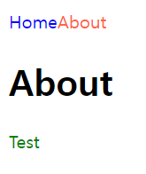
<br/>

`global style` 과 `css JSX` 를 적절히 사용한 모습

<br/>
<br/>
<hr/>

###### 20230506

> ## Helmet title

<br/>

- `Next.js` 에서는 `CRA` 에서 `react-helmet` 을 설치해서 사용하는 것과 다르게 내부의 패키지를 사용해 바로 사용 가능
- title 내부에 바로 작성하면 새로고침 시 **깨짐 현상이 생기므로 형식에 맞춰서 작성**

<br/>

```TSX
//Helmet.tsx
import Head from "next/head";
// Next.js 에서는 즉각적으로 해당하는 패키지를 사용 할 수 있음

interface IHelmet {
  title: String;
}

export default function Helmet({ title }: IHelmet) {
  return (
    <>
      <Head>
        <title>{`${title} | Next Movies`}</title>
      </Head>
    </>
  );
}


// about.tsx
import Helmet from "@/components/Helmet";

export default function about() {
  return (
    <div>
      <Helmet title="about" />
      <h1>About</h1>
    </div>
  );
}

```

<br/>
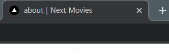
<br/>

<br/>
<br/>
<hr/>

> ## connect API

<br/>

- **API** 를 받아올 **OpenAPI** [링크](https://www.themoviedb.org/)
- API 를 받아오기 위해 `react-query` 사용

<br/>

```TSX
// api/api.ts
export function getMovies() {
  return fetch(
    `https://api.themoviedb.org/3/movie/popular?api_key=${API_KEY}`
  ).then((response) => response.json());
}

// index.tsx
export default function Home() {
  const { data, isLoading } = useQuery<IGetMoviesProps>(
    ["movie, popular"],
    getMovies
  ); // react-query 를 이용

  return (
    <div className="container">
      <Helmet title="home" />
      {isLoading ? (
        <h4>Loading...</h4>
      ) : (
        data?.results.map((movie) => (
          <div className="movie" key={movie.id}>
            
            <h4>{movie.original_title}</h4>
          </div>
        ))
      )}

      <style jsx>{styled}</style>
    </div>
  );
}

// _app.tsx
export default function App({ Component, pageProps }: AppProps) {
  const queryClient = new QueryClient();
  // react-query 를 사용하기 위함
  return (
    <>
      <Layout>
        <QueryClientProvider client={queryClient}>
          <Component {...pageProps} />
        </QueryClientProvider>
      </Layout>
    </>
  );
}
```

<br/>
<p>


<p/>
<br/>

`react-query` 를 사용해 **API** 통신하는 모습

그 후 `CSS` 도 입혀주었음

<br/>
<br/>
<hr/>

###### 20230507

> ## Redirects()

<br/>

- `redirects()` 는 해당하는 주소에 방문 하였을 때 **다른 주소로 우회 해줌**
- `source` 는 요청하는 주소, `destination` 은 목적지 주소, `permanent` 는 영속성 (브라우저나 검색엔진이 해당 값을 기억하는지)
- `*` 는 해당 **url-source** 값을 **catch** 하는데 사용

<br/>

```JS
const nextConfig = {
  reactStrictMode: true,
  async redirects() {
    return [
      {
        source: "/old/:path*",
        destination: "/new/:path*",
        permanent: false,
      },
    ];
  },
};
```

<br/>
<br/>

> ## Rewrites()

<br/>

- `rewrites()` 는 해당하는 주소로 방문 할 시 **동작하는 url 과 보여지는 url 이 다름**
- 해당하는 특징을 이용해 `api-key` 등을 **masking** 하는데 유용

<br/>

```JS
const API_KEY = process.env.API_KEY; // env 파일을 생성해 API_KEY 를 숨겨줌

const nextConfig = {
  reactStrictMode: true,
  async rewrites() {
    return [
      {
        source: "/api/movies",
        destination: `https://api.themoviedb.org/3/movie/popular?api_key=${API_KEY}`,
      },
    ];
  },
};
```

<br/>
<p>
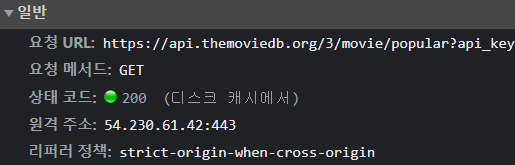
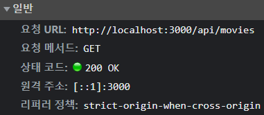
<p>
<br/>
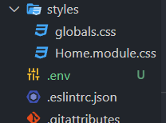
<br/>

<br/>
<br/>
<hr/>

###### 20230508

> ## Dynamic route

<br/>

- `Next.js` 는 **page > (folder-name) > [variable-name]** 으로 페이지를 동적으로 라우팅 할 수 있음
- `useRouter()` hook 과 연계하면 간단하게 만들 수 있음
- `useRouter()` 로 넘겨주는 `query` 값이 많아 url 이 지저분 할 수 있는데 **Masking** 으로 해결

<br/>

```TSX

  return (
    // index.tsx
    <div className="container">
      <Helmet title="home" />

      {results?.map((movie: IMovieProps) => (
        <Link
          href={{
            pathname: `/movies/${movie.id}`,
            query: {
              title: movie.original_title,
            },
          }}
          as={`/movies/${movie.id}`}
          key={movie.id}
        >
          <div className="movie">
            
            <h4>{movie.original_title}</h4>
          </div>
        </Link>
      ))}

      <style jsx>{styled}</style>
    </div>
  );

  // movies/[id].tsx
  import { useRouter } from "next/router";

  export default function Detail() {
    const router = useRouter();

    return (
      <div>
        <h4>{router.query.title || "Loading..."}</h4>
      </div>
    );
  }

  // next.config.js
    async rewrites() {
    return [
      {
        source: "/api/movies",
        destination: `https://api.themoviedb.org/3/movie/popular?api_key=${API_KEY}`,
      },

      {
        source: "/api/movies/:id",
        destination: `https://api.themoviedb.org/3/movie/:id?api_key=${API_KEY}`,
      },
      // movie/{movie_id} 에 id 가 들어가야 하므로
      // api 의 위치는 openAPI 문서를 찾아보자
    ];
  },

```

<br/>
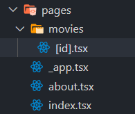
<br/>
<p>
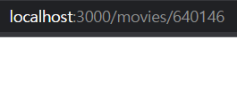
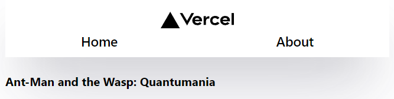
<p/>

<br/>
<br/>
<hr/>

###### 20230511

> ## Next.js font

<br/>

- `Next.js` 는 `google-font` 가 내장되어 있음
- 바로 사용하면 됨 [공식문서 참고](https://nextjs.org/docs/pages/building-your-application/optimizing/fonts)

<br/>

```TSX
import { Roboto } from "next/font/google";
// next.js 는 google-font 가 내장 되어있음

const inter = Roboto({
  preload: false,
  weight: ["400"],
}); // 쓰는법은 공식문서 참고
```

<br/>
<p>
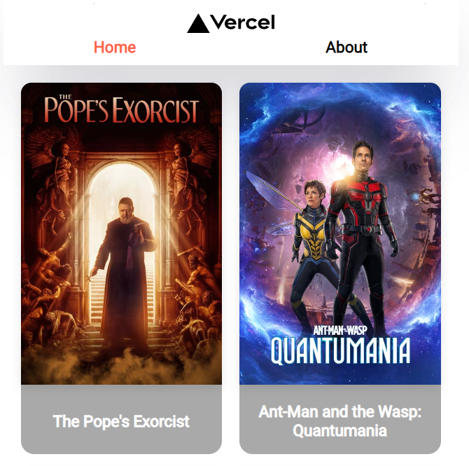
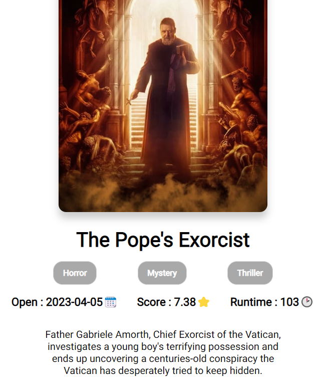
<p/>
<br/>

자잘한 스타일 추가

<br/>

`npm install react-icons --save`

```TSX
// Footer.tsx
import { FaGithubSquare } from "react-icons/fa";

...


export default function Footer() {
  return (
    <>
      <div className="footer">
        <Link href="https://github.com/ezurno/next-movies">
          <div className="footText">
            <FaGithubSquare
              style={{
                color: "darkgrey",
                fontSize: "50px",
              }}
            />

            <h4>20230511 @ezurno</h4>
          </div>
        </Link>
      </div>
      <style jsx>{styled}</style>
    </>
  );
}
```

<br/>
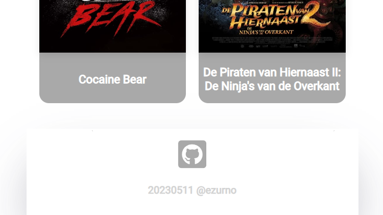
<br/>

하단부분 `footer` 와 `GitHub-icon` 추가

<br/>
<br/>
<hr/>

###### 20230512

> ## 404-Not Found

<br/>

- `Next.js` 에서는 **404:Not-Found** 를 손쉽게 컨트롤 할 수 있음
- `pages > 404.tsx` 생성

<br/>
<p>
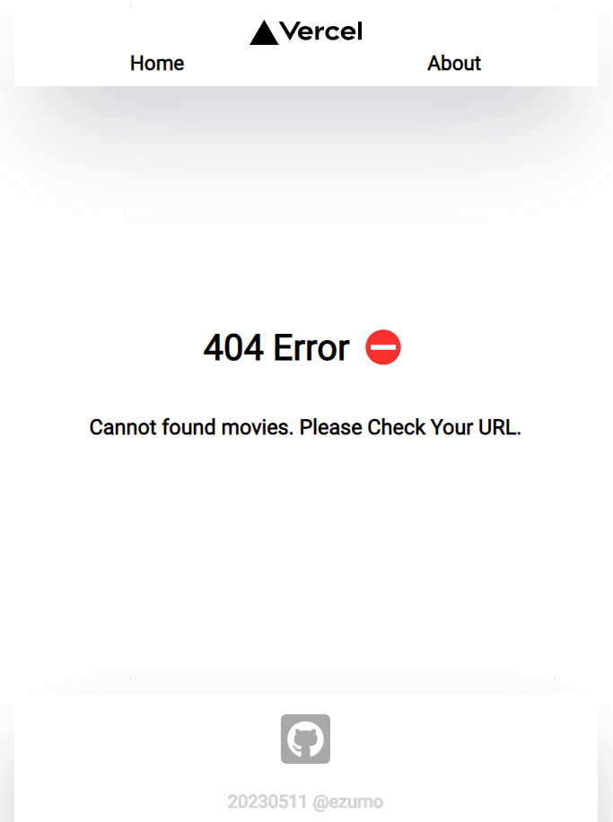
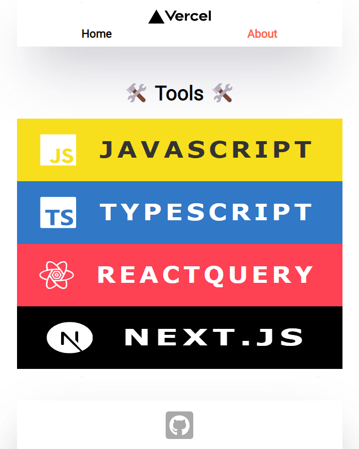
</p>
<br/>

`404 page` 와 `about page` setting
